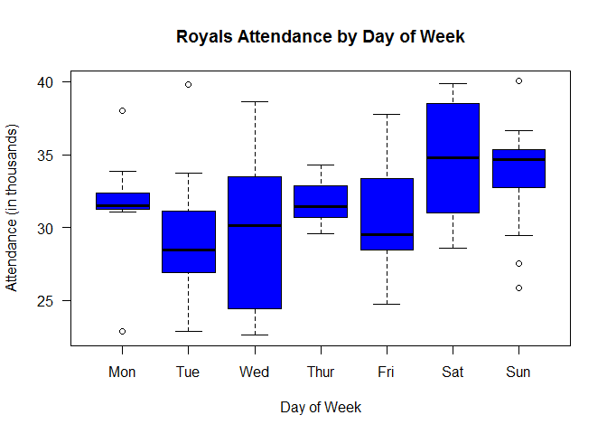
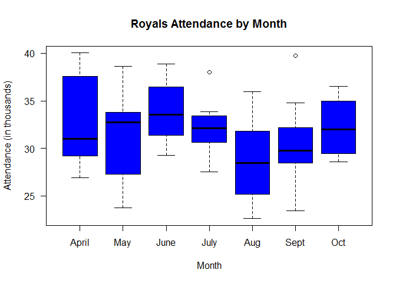

2016 KC Royals Promotion and Attendance
================
JTally

``` r
# package for linear regression
library(car)
# package for graphics
library(lattice)
```

``` r
# input data and create a data frame (df) 
royals = read.csv("royals.csv")
# look at the head of the df 
print(head(royals))
```

    ##   month day attend day_of_week opponent temp  skies day_night cap shirt
    ## 1   APR   3  40030      Sunday     Mets   74  Clear     Night  NO    NO
    ## 2   APR   5  39782     Tuesday     Mets   68  Clear       Day  NO    NO
    ## 3   APR   8  27166      Friday    Twins   58  Clear     Night  NO    NO
    ## 4   APR   9  31001    Saturday    Twins   60  Clear     Night  NO    NO
    ## 5   APR  10  35317      Sunday    Twins   68 Cloudy       Day  NO    NO
    ## 6   APR  19  26889     Tuesday   Tigers   67 Cloudy     Night  NO    NO
    ##   fireworks bobblehead bucknight
    ## 1        NO         NO        NO
    ## 2        NO         NO        NO
    ## 3        NO         NO        NO
    ## 4        NO         NO        NO
    ## 5        NO         NO        NO
    ## 6        NO         NO        NO

``` r
# look at the structure of the df
print(str(royals))
```

    ## 'data.frame':    81 obs. of  13 variables:
    ##  $ month      : Factor w/ 9 levels "APR","AUG","JUL",..: 1 1 1 1 1 1 1 1 1 1 ...
    ##  $ day        : int  3 5 8 9 10 19 20 21 22 23 ...
    ##  $ attend     : int  40030 39782 27166 31001 35317 26889 28928 30763 29546 39900 ...
    ##  $ day_of_week: Factor w/ 7 levels "Friday","Monday",..: 4 6 1 3 4 6 7 5 1 3 ...
    ##  $ opponent   : Factor w/ 18 levels "Angels","Astros",..: 9 9 16 16 16 15 15 15 11 11 ...
    ##  $ temp       : int  74 68 58 60 68 67 68 66 66 78 ...
    ##  $ skies      : Factor w/ 2 levels "Clear","Cloudy": 1 1 1 1 2 2 2 2 2 1 ...
    ##  $ day_night  : Factor w/ 2 levels "Day","Night": 2 1 2 2 1 2 2 2 2 2 ...
    ##  $ cap        : Factor w/ 2 levels "NO","YES": 1 1 1 1 1 1 1 1 1 1 ...
    ##  $ shirt      : Factor w/ 2 levels "NO","YES": 1 1 1 1 1 1 1 1 1 1 ...
    ##  $ fireworks  : Factor w/ 2 levels "NO","YES": 1 1 1 1 1 1 1 1 1 1 ...
    ##  $ bobblehead : Factor w/ 2 levels "NO","YES": 1 1 1 1 1 1 1 1 1 1 ...
    ##  $ bucknight  : Factor w/ 2 levels "NO","YES": 1 1 1 1 1 1 1 2 1 1 ...
    ## NULL

``` r
# look at the summary statistics 
print(summary(royals))
```

    ##      month         day            attend         day_of_week
    ##  SEP    :14   Min.   : 1.00   Min.   :22615   Friday   :13  
    ##  AUG    :13   1st Qu.:10.00   1st Qu.:28928   Monday   : 9  
    ##  JUL    :13   Median :18.00   Median :31502   Saturday :13  
    ##  JUN    :13   Mean   :16.79   Mean   :31577   Sunday   :14  
    ##  MAY    :12   3rd Qu.:24.00   3rd Qu.:34310   Thursday : 7  
    ##  APR    :11   Max.   :31.00   Max.   :40030   Tuesday  :13  
    ##  (Other): 5                                   Wednesday:12  
    ##       opponent       temp          skies    day_night   cap     shirt   
    ##  Tigers   :10   Min.   :55.00   Clear :38   Day  :21   NO :79   NO :74  
    ##  Twins    :10   1st Qu.:68.00   Cloudy:43   Night:60   YES: 2   YES: 7  
    ##  White Sox:10   Median :81.00                                           
    ##  Indians  : 9   Mean   :78.72                                           
    ##  Athletics: 4   3rd Qu.:87.00                                           
    ##  Mariners : 4   Max.   :97.00                                           
    ##  (Other)  :34                                                           
    ##  fireworks bobblehead bucknight
    ##  NO :73    NO :76     NO :74   
    ##  YES: 8    YES: 5     YES: 7   
    ##                                
    ##                                
    ##                                
    ##                                
    ## 

``` r
# create the variable ordered day of the week needed for a boxplot 
royals$ord_day_week = with(data=royals,
    ifelse ((day_of_week == "Monday"),1,
    ifelse ((day_of_week == "Tuesday"),2,
    ifelse ((day_of_week == "Wednesday"),3,
    ifelse ((day_of_week == "Thursday"),4,
    ifelse ((day_of_week == "Friday"),5,
    ifelse ((day_of_week == "Saturday"),6,7)))))))
royals$ord_day_week = factor(royals$ord_day_week, levels = 1:7,
labels=c("Mon", "Tue", "Wed", "Thur", "Fri", "Sat", "Sun"))
```

``` r
# Exploratory analysis - distributions of attendance across days of the week
with(data=royals,plot(ord_day_week, attend/1000, main = "Royals Attendance by Day of Week",
xlab = "Day of Week", ylab = "Attendance (in thousands)",
col = "blue", las = 1))
```



``` r
# look to see when the Royals use a certain promotion
with(royals, table(cap, ord_day_week)) # caps once on a Sat and Sun
```

    ##      ord_day_week
    ## cap   Mon Tue Wed Thur Fri Sat Sun
    ##   NO    9  13  12    7  13  12  13
    ##   YES   0   0   0    0   0   1   1

``` r
with(royals, table(shirt, ord_day_week)) # shirts on Tues and one Sat
```

    ##      ord_day_week
    ## shirt Mon Tue Wed Thur Fri Sat Sun
    ##   NO    9   7  12    7  13  12  14
    ##   YES   0   6   0    0   0   1   0

``` r
with(royals, table(fireworks, ord_day_week)) # fireworks on Fris
```

    ##          ord_day_week
    ## fireworks Mon Tue Wed Thur Fri Sat Sun
    ##       NO    9  13  12    7   5  13  14
    ##       YES   0   0   0    0   8   0   0

``` r
with(royals, table(bobblehead, ord_day_week)) # bobbleheads on Sats and once Sun
```

    ##           ord_day_week
    ## bobblehead Mon Tue Wed Thur Fri Sat Sun
    ##        NO    9  13  12    7  13   9  13
    ##        YES   0   0   0    0   0   4   1

``` r
with(royals, table(bucknight, ord_day_week)) # bucknight on Thurs
```

    ##          ord_day_week
    ## bucknight Mon Tue Wed Thur Fri Sat Sun
    ##       NO    9  13  12    0  13  13  14
    ##       YES   0   0   0    7   0   0   0

``` r
# create the variable ordered month for another boxplot 
royals$ord_month = with(data=royals,
    ifelse ((month == "APR"),4,
    ifelse ((month == "MAY"),5,
    ifelse ((month == "JUN"),6,
    ifelse ((month == "JUL"),7,
    ifelse ((month == "AUG"),8,
    ifelse ((month == "SEP"),9,10)))))))
royals$ord_month = factor(royals$ord_month, levels=4:10,
labels = c("April", "May", "June", "July", "Aug", "Sept", "Oct"))
```

``` r
# # Exploratory analysis - distributions of attendance by month 
with(data=royals,plot(ord_month,attend/1000, main = "Royals Attendance by Month",
xlab = "Month", ylab = "Attendance (in thousands)", col = "blue", las = 1))
```


