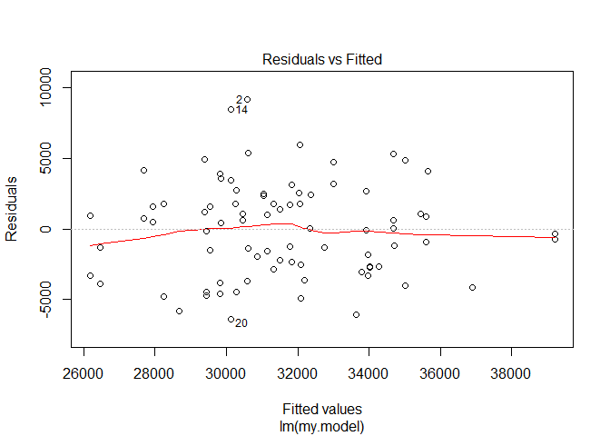
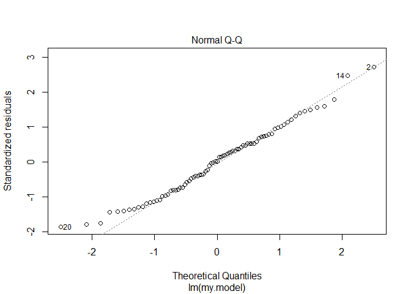
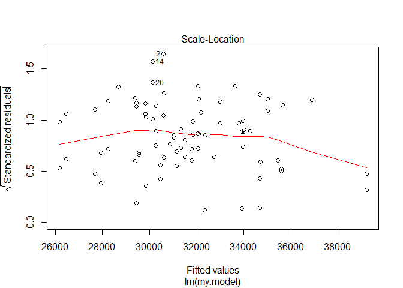
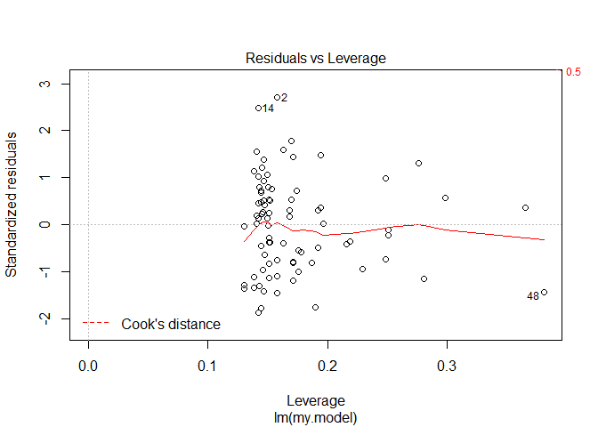
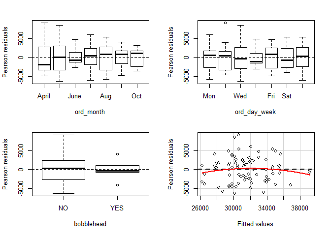
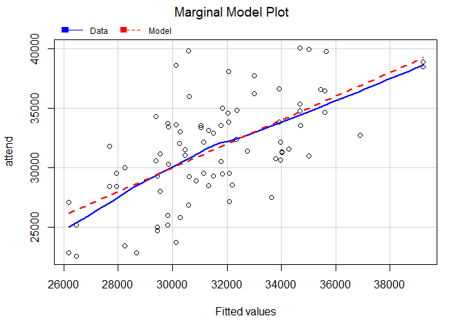

2016 KC Royals Promotion and Attendance
================
JTally

``` r
# package for linear regression
library(car)
# packages for graphics
library(ggplot2)
library(lattice)
```

``` r
# input data and create a data frame (df) 
royals = read.csv("royals.csv")
# checking out the data for errors and any other info
# the top of the df 
print(head(royals))
```

    ##   month day attend day_of_week opponent temp  skies day_night cap shirt
    ## 1   APR   3  40030      Sunday     Mets   74  Clear     Night  NO    NO
    ## 2   APR   5  39782     Tuesday     Mets   68  Clear       Day  NO    NO
    ## 3   APR   8  27166      Friday    Twins   58  Clear     Night  NO    NO
    ## 4   APR   9  31001    Saturday    Twins   60  Clear     Night  NO    NO
    ## 5   APR  10  35317      Sunday    Twins   68 Cloudy       Day  NO    NO
    ## 6   APR  19  26889     Tuesday   Tigers   67 Cloudy     Night  NO    NO
    ##   fireworks bobblehead bucknight
    ## 1        NO         NO        NO
    ## 2        NO         NO        NO
    ## 3        NO         NO        NO
    ## 4        NO         NO        NO
    ## 5        NO         NO        NO
    ## 6        NO         NO        NO

``` r
# the structure of the df
print(str(royals))
```

    ## 'data.frame':    81 obs. of  13 variables:
    ##  $ month      : Factor w/ 9 levels "APR","AUG","JUL",..: 1 1 1 1 1 1 1 1 1 1 ...
    ##  $ day        : int  3 5 8 9 10 19 20 21 22 23 ...
    ##  $ attend     : int  40030 39782 27166 31001 35317 26889 28928 30763 29546 39900 ...
    ##  $ day_of_week: Factor w/ 7 levels "Friday","Monday",..: 4 6 1 3 4 6 7 5 1 3 ...
    ##  $ opponent   : Factor w/ 18 levels "Angels","Astros",..: 9 9 16 16 16 15 15 15 11 11 ...
    ##  $ temp       : int  74 68 58 60 68 67 68 66 66 78 ...
    ##  $ skies      : Factor w/ 2 levels "Clear","Cloudy": 1 1 1 1 2 2 2 2 2 1 ...
    ##  $ day_night  : Factor w/ 2 levels "Day","Night": 2 1 2 2 1 2 2 2 2 2 ...
    ##  $ cap        : Factor w/ 2 levels "NO","YES": 1 1 1 1 1 1 1 1 1 1 ...
    ##  $ shirt      : Factor w/ 2 levels "NO","YES": 1 1 1 1 1 1 1 1 1 1 ...
    ##  $ fireworks  : Factor w/ 2 levels "NO","YES": 1 1 1 1 1 1 1 1 1 1 ...
    ##  $ bobblehead : Factor w/ 2 levels "NO","YES": 1 1 1 1 1 1 1 1 1 1 ...
    ##  $ bucknight  : Factor w/ 2 levels "NO","YES": 1 1 1 1 1 1 1 2 1 1 ...
    ## NULL

``` r
# summary statistics 
print(summary(royals))
```

    ##      month         day            attend         day_of_week
    ##  SEP    :14   Min.   : 1.00   Min.   :22615   Friday   :13  
    ##  AUG    :13   1st Qu.:10.00   1st Qu.:28928   Monday   : 9  
    ##  JUL    :13   Median :18.00   Median :31502   Saturday :13  
    ##  JUN    :13   Mean   :16.79   Mean   :31577   Sunday   :14  
    ##  MAY    :12   3rd Qu.:24.00   3rd Qu.:34310   Thursday : 7  
    ##  APR    :11   Max.   :31.00   Max.   :40030   Tuesday  :13  
    ##  (Other): 5                                   Wednesday:12  
    ##       opponent       temp          skies    day_night   cap     shirt   
    ##  Tigers   :10   Min.   :55.00   Clear :38   Day  :21   NO :79   NO :74  
    ##  Twins    :10   1st Qu.:68.00   Cloudy:43   Night:60   YES: 2   YES: 7  
    ##  White Sox:10   Median :81.00                                           
    ##  Indians  : 9   Mean   :78.72                                           
    ##  Athletics: 4   3rd Qu.:87.00                                           
    ##  Mariners : 4   Max.   :97.00                                           
    ##  (Other)  :34                                                           
    ##  fireworks bobblehead bucknight
    ##  NO :73    NO :76     NO :74   
    ##  YES: 8    YES: 5     YES: 7   
    ##                                
    ##                                
    ##                                
    ##                                
    ## 

``` r
# variable for ordered day of the week needed for exploration
royals$ord_day_week = with(data=royals,
    ifelse ((day_of_week == "Monday"),1,
    ifelse ((day_of_week == "Tuesday"),2,
    ifelse ((day_of_week == "Wednesday"),3,
    ifelse ((day_of_week == "Thursday"),4,
    ifelse ((day_of_week == "Friday"),5,
    ifelse ((day_of_week == "Saturday"),6,7)))))))
royals$ord_day_week = factor(royals$ord_day_week, levels = 1:7,
labels=c("Mon", "Tue", "Wed", "Thur", "Fri", "Sat", "Sun"))
```

``` r
# Exploratory analysis - distributions of attendance across days of the week
with(data=royals,plot(ord_day_week, attend/1000, main = "Royals Attendance by Day of Week",
xlab = "Day of Week", ylab = "Attendance (in thousands)",
col = "blue", las = 1))
```


``` r
# look to see when the Royals use a certain promotion
with(royals, table(cap, ord_day_week)) # caps once on a Sat and Sun
```

    ##      ord_day_week
    ## cap   Mon Tue Wed Thur Fri Sat Sun
    ##   NO    9  13  12    7  13  12  13
    ##   YES   0   0   0    0   0   1   1

``` r
with(royals, table(shirt, ord_day_week)) # shirts on Tues and one Sat
```

    ##      ord_day_week
    ## shirt Mon Tue Wed Thur Fri Sat Sun
    ##   NO    9   7  12    7  13  12  14
    ##   YES   0   6   0    0   0   1   0

``` r
with(royals, table(fireworks, ord_day_week)) # fireworks on Fris
```

    ##          ord_day_week
    ## fireworks Mon Tue Wed Thur Fri Sat Sun
    ##       NO    9  13  12    7   5  13  14
    ##       YES   0   0   0    0   8   0   0

``` r
with(royals, table(bobblehead, ord_day_week)) # bobbleheads on Sats and one Sun
```

    ##           ord_day_week
    ## bobblehead Mon Tue Wed Thur Fri Sat Sun
    ##        NO    9  13  12    7  13   9  13
    ##        YES   0   0   0    0   0   4   1

``` r
with(royals, table(bucknight, ord_day_week)) # bucknight on Thurs
```

    ##          ord_day_week
    ## bucknight Mon Tue Wed Thur Fri Sat Sun
    ##       NO    9  13  12    0  13  13  14
    ##       YES   0   0   0    7   0   0   0

``` r
# variable for ordered month for more exploration  
royals$ord_month = with(data=royals,
    ifelse ((month == "APR"),4,
    ifelse ((month == "MAY"),5,
    ifelse ((month == "JUN"),6,
    ifelse ((month == "JUL"),7,
    ifelse ((month == "AUG"),8,
    ifelse ((month == "SEP"),9,10)))))))
royals$ord_month = factor(royals$ord_month, levels=4:10,
labels = c("April", "May", "June", "July", "Aug", "Sept", "Oct"))
```

``` r
# # Exploratory analysis - distributions of attendance by month 
with(data=royals,plot(ord_month,attend/1000, main = "Royals Attendance by Month",
xlab = "Month", ylab = "Attendance (in thousands)", col = "blue", las = 1))
```


``` r
# Exploratory analysis - showing different variables affect on attendance using ggplot2
# the relationship between temp and attend, controlling for day/night and clear/cloudy skies 
ggplot(royals, aes(x=temp, y=attend/1000,shape=fireworks))+
  geom_point(aes(color=fireworks),size=3) + facet_grid(day_night~skies,switch="both") +
  theme_dark() + xlab("Temperature (F)") + ylab("Attendance (in thousands)") + 
  ggtitle("Royals Weather, Fireworks and Attendance") +  scale_colour_brewer(palette = "PuBu")
```


``` r
# plots of attendance by opponent(visiting team)
ggplot(royals,aes(x=attend/1000,y=opponent,shape=day_night))+
  geom_point(aes(color=day_night),size=2)+scale_shape_manual(values=c(19,19))+
  scale_color_manual(values = c("white","black"))+theme_dark()+
  xlab("Attendance (in thousands)") +ylab("Opponent") + 
  ggtitle("Royals Attendance by Visiting Team") 
```


``` r
# Do promotions have a positive effect on attendance? How much might the effect be?
# Can create a linear model for predicting attendance using month, day, and an indicator
# variable.  
# Does X promotions increase attendance, controlling for the month and day of the week?

# defining a model 
my.model = {attend ~ ord_month + ord_day_week + bobblehead}

# creating training and test setup
# setting seed
set.seed(1234)
train_test = c(rep(1,length=trunc((2/3)*nrow(royals))),
rep(2,length=(nrow(royals) - trunc((2/3)*nrow(royals)))))
# random permutation
royals$train_test = sample(train_test)
royals$train_test = factor(royals$train_test,
  levels=c(1,2), labels=c("TRAIN","TEST"))
royals.train = subset(royals, train_test == "TRAIN")
# check training
print(str(royals.train))
```

    ## 'data.frame':    54 obs. of  16 variables:
    ##  $ month       : Factor w/ 9 levels "APR","AUG","JUL",..: 1 1 1 1 1 1 5 5 5 5 ...
    ##  $ day         : int  3 5 8 20 21 23 2 3 15 18 ...
    ##  $ attend      : int  40030 39782 27166 28928 30763 39900 32394 33729 33861 33613 ...
    ##  $ day_of_week : Factor w/ 7 levels "Friday","Monday",..: 4 6 1 7 5 3 2 6 4 7 ...
    ##  $ opponent    : Factor w/ 18 levels "Angels","Astros",..: 9 9 16 15 15 11 10 10 5 14 ...
    ##  $ temp        : int  74 68 58 68 66 78 55 68 66 65 ...
    ##  $ skies       : Factor w/ 2 levels "Clear","Cloudy": 1 1 1 2 2 1 2 2 2 2 ...
    ##  $ day_night   : Factor w/ 2 levels "Day","Night": 2 1 2 2 2 2 2 2 1 1 ...
    ##  $ cap         : Factor w/ 2 levels "NO","YES": 1 1 1 1 1 1 1 1 2 1 ...
    ##  $ shirt       : Factor w/ 2 levels "NO","YES": 1 1 1 1 1 1 1 2 1 1 ...
    ##  $ fireworks   : Factor w/ 2 levels "NO","YES": 1 1 1 1 1 1 1 1 1 1 ...
    ##  $ bobblehead  : Factor w/ 2 levels "NO","YES": 1 1 1 1 1 1 1 1 1 1 ...
    ##  $ bucknight   : Factor w/ 2 levels "NO","YES": 1 1 1 1 2 1 1 1 1 1 ...
    ##  $ ord_day_week: Factor w/ 7 levels "Mon","Tue","Wed",..: 7 2 5 3 4 6 1 2 7 3 ...
    ##  $ ord_month   : Factor w/ 7 levels "April","May",..: 1 1 1 1 1 1 2 2 2 2 ...
    ##  $ train_test  : Factor w/ 2 levels "TRAIN","TEST": 1 1 1 1 1 1 1 1 1 1 ...
    ## NULL

``` r
royals.test = subset(royals, train_test == "TEST")
# check test
print(str(royals.test))
```

    ## 'data.frame':    27 obs. of  16 variables:
    ##  $ month       : Factor w/ 9 levels "APR","AUG","JUL",..: 1 1 1 1 1 5 5 6 5 5 ...
    ##  $ day         : int  9 10 19 22 24 4 13 14 17 27 ...
    ##  $ attend      : int  31001 35317 26889 29546 34748 38610 33132 36541 25215 28508 ...
    ##  $ day_of_week : Factor w/ 7 levels "Friday","Monday",..: 3 4 6 1 4 7 1 3 6 1 ...
    ##  $ opponent    : Factor w/ 18 levels "Angels","Astros",..: 16 16 15 11 11 10 5 5 14 17 ...
    ##  $ temp        : int  60 68 67 66 79 68 62 60 58 73 ...
    ##  $ skies       : Factor w/ 2 levels "Clear","Cloudy": 1 2 2 2 1 1 2 1 2 2 ...
    ##  $ day_night   : Factor w/ 2 levels "Day","Night": 2 1 2 2 1 1 2 2 2 2 ...
    ##  $ cap         : Factor w/ 2 levels "NO","YES": 1 1 1 1 1 1 1 1 1 1 ...
    ##  $ shirt       : Factor w/ 2 levels "NO","YES": 1 1 1 1 1 1 1 1 1 1 ...
    ##  $ fireworks   : Factor w/ 2 levels "NO","YES": 1 1 1 1 1 1 2 1 1 2 ...
    ##  $ bobblehead  : Factor w/ 2 levels "NO","YES": 1 1 1 1 1 1 1 2 1 1 ...
    ##  $ bucknight   : Factor w/ 2 levels "NO","YES": 1 1 1 1 1 1 1 1 1 1 ...
    ##  $ ord_day_week: Factor w/ 7 levels "Mon","Tue","Wed",..: 6 7 2 5 7 3 5 6 2 5 ...
    ##  $ ord_month   : Factor w/ 7 levels "April","May",..: 1 1 1 1 1 2 2 7 2 2 ...
    ##  $ train_test  : Factor w/ 2 levels "TRAIN","TEST": 2 2 2 2 2 2 2 2 2 2 ...
    ## NULL

``` r
# fit model to training set
train.model.fit = lm(my.model, data=royals.train)
# get predictions from training set 
royals.train$predict_attend = predict(train.model.fit)

# examine the fitted model on the test set
royals.test$predict_attend = predict(train.model.fit, 
  newdata = royals.test)

# calculate the proportion of response variance accounted for when predicting out of sample
cat("\n","Proportion of test set variance accounted for: ",
round((with(royals.test, cor(attend,predict_attend)^2)),
  digits = 3),"\n",sep="")
```

    ## 
    ## Proportion of test set variance accounted for: 0.077

``` r
# combine the training and test sets for plotting
royals.plotting.frame = rbind(royals.train,royals.test)

# visualization for predictive modeling
group.labels = c("No Bobbleheads","Bobbleheads")
group.symbols = c(19,24)
group.colors = c("black","black") 
group.fill <- c("black","blue")  
xyplot(predict_attend/1000 ~ attend/1000 | train_test, 
       data = royals.plotting.frame, groups = bobblehead, cex = 1,
       pch = group.symbols, col = group.colors, fill = group.fill, 
       layout = c(2, 1), xlim = c(20,65), ylim = c(20,65), 
       aspect=1, type = c("p","g"),
       panel=function(x,y, ...)
            {panel.xyplot(x,y,...)
             panel.segments(25,25,60,60,col="black",cex=1)
            },
       strip=function(...) strip.default(..., style=1),
       xlab = "Actual Attendance (in thousands)", 
       ylab = "Predicted Attendance (in thousands)",
       key = list(space = "top", 
              text = list(rev(group.labels),col = rev(group.colors)),
              points = list(pch = rev(group.symbols), 
              col = rev(group.colors),
              fill = rev(group.fill))))
```


``` r
# getting estimate of the increase in attendance due to bobbleheads

# use all data
my.model.fit = lm(my.model, data= royals)
print(summary(my.model.fit))
```

    ## 
    ## Call:
    ## lm(formula = my.model, data = royals)
    ## 
    ## Residuals:
    ##     Min      1Q  Median      3Q     Max 
    ## -6391.7 -2674.1    72.6  2350.9  9201.0 
    ## 
    ## Coefficients:
    ##                  Estimate Std. Error t value Pr(>|t|)    
    ## (Intercept)       33093.2     1751.6  18.893  < 2e-16 ***
    ## ord_monthMay       -747.9     1573.2  -0.475  0.63604    
    ## ord_monthJune       916.6     1573.9   0.582  0.56229    
    ## ord_monthJuly     -1040.4     1546.9  -0.673  0.50354    
    ## ord_monthAug      -4399.6     1528.3  -2.879  0.00535 ** 
    ## ord_monthSept     -2641.4     1532.7  -1.723  0.08943 .  
    ## ord_monthOct      -2832.7     2071.0  -1.368  0.17595    
    ## ord_day_weekTue   -2512.2     1636.2  -1.535  0.12941    
    ## ord_day_weekWed   -2214.6     1656.6  -1.337  0.18582    
    ## ord_day_weekThur    708.6     1898.5   0.373  0.71014    
    ## ord_day_weekFri   -1012.7     1629.8  -0.621  0.53647    
    ## ord_day_weekSat    1926.9     1748.1   1.102  0.27430    
    ## ord_day_weekSun    1582.2     1624.8   0.974  0.33365    
    ## bobbleheadYES      3264.6     1998.2   1.634  0.10700    
    ## ---
    ## Signif. codes:  0 '***' 0.001 '**' 0.01 '*' 0.05 '.' 0.1 ' ' 1
    ## 
    ## Residual standard error: 3698 on 67 degrees of freedom
    ## Multiple R-squared:  0.3932, Adjusted R-squared:  0.2755 
    ## F-statistic:  3.34 on 13 and 67 DF,  p-value: 0.0005808

``` r
# test statistical significance of the bobblehead promotion
# type I anova calculates sums of squares for sequential tests
print(anova(my.model.fit))
```

    ## Analysis of Variance Table
    ## 
    ## Response: attend
    ##              Df    Sum Sq  Mean Sq F value   Pr(>F)   
    ## ord_month     6 271813757 45302293  3.3135 0.006453 **
    ## ord_day_week  6 285335256 47555876  3.4784 0.004715 **
    ## bobblehead    1  36493696 36493696  2.6692 0.106995   
    ## Residuals    67 916018307 13671915                    
    ## ---
    ## Signif. codes:  0 '***' 0.001 '**' 0.01 '*' 0.05 '.' 0.1 ' ' 1

``` r
cat("\n","Estimated Effect of the Bobblehead Promotion on Attendance: ",
round(my.model.fit$coefficients[length(my.model.fit$coefficients)],
digits = 0),"\n",sep="")
```

    ## 
    ## Estimated Effect of the Bobblehead Promotion on Attendance: 3265

``` r
# diagnostic plots
plot(my.model.fit)
```



``` r
# more model diagnostics 
residualPlots(my.model.fit)
```



    ##              Test stat Pr(>|t|)
    ## ord_month           NA       NA
    ## ord_day_week        NA       NA
    ## bobblehead          NA       NA
    ## Tukey test      -1.345    0.179

``` r
marginalModelPlots(my.model.fit)
```

    ## Warning in mmps(...): Interactions and/or factors skipped



``` r
print(outlierTest(my.model.fit))
```

    ## 
    ## No Studentized residuals with Bonferonni p < 0.05
    ## Largest |rstudent|:
    ##   rstudent unadjusted p-value Bonferonni p
    ## 2 2.852172          0.0057919      0.46914
